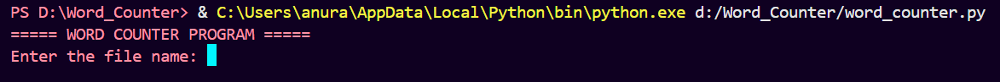
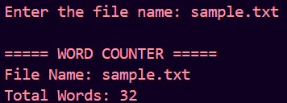
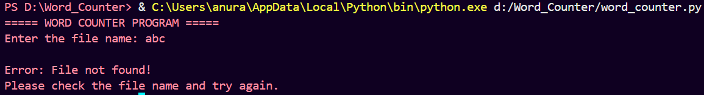

# Word Counter

## Overview

Word Counter is a Python-based command-line application that reads a text file and counts the total number of words present in the file.

The project demonstrates file handling, string manipulation, exception handling, and user interaction using Python.

## Features

* Reads content from a text file
* Counts total number of words
* User can enter a custom file name
* Handles file not found errors
* Clean and user-friendly output
* Exception handling for better reliability

## Technologies Used

* Python 3

## Project Structure

Word_Counter/

├── word_counter.py

├── sample.txt

├── README.md

└── screenshots/

    ├── program_start.png

    ├── word_count_result.png

    └── file_not_found.png

## How to Run the Project

### Step 1: Clone or Download the Project

Download the project folder to your computer.

### Step 2: Open Terminal

Navigate to the project directory.

### Step 3: Run the Program

```bash
python word_counter.py
```

### Step 4: Enter the File Name

Example:

```text
sample.txt
```

The program will read the file and display the total number of words.

## Sample Output

```text
===== WORD COUNTER PROGRAM =====
Enter the file name: sample.txt

===== WORD COUNTER =====
File Name: sample.txt
Total Words: 32
```

## Screenshots

### Program Start



### Word Count Result



### File Not Found Handling



## Concepts Used

* File Handling
* Functions
* Exception Handling
* String Manipulation
* User Input
* Python Built-in Functions

## Learning Outcomes

Through this project, the following concepts were practiced:

* Reading data from text files
* Processing text using string methods
* Counting words efficiently
* Handling file-related exceptions
* Building command-line applications
* Writing clean and maintainable code

## Future Enhancements

* Count characters in a file
* Count lines in a file
* Count paragraphs
* Display most frequently used words
* Support multiple file formats

## Author

Anurag